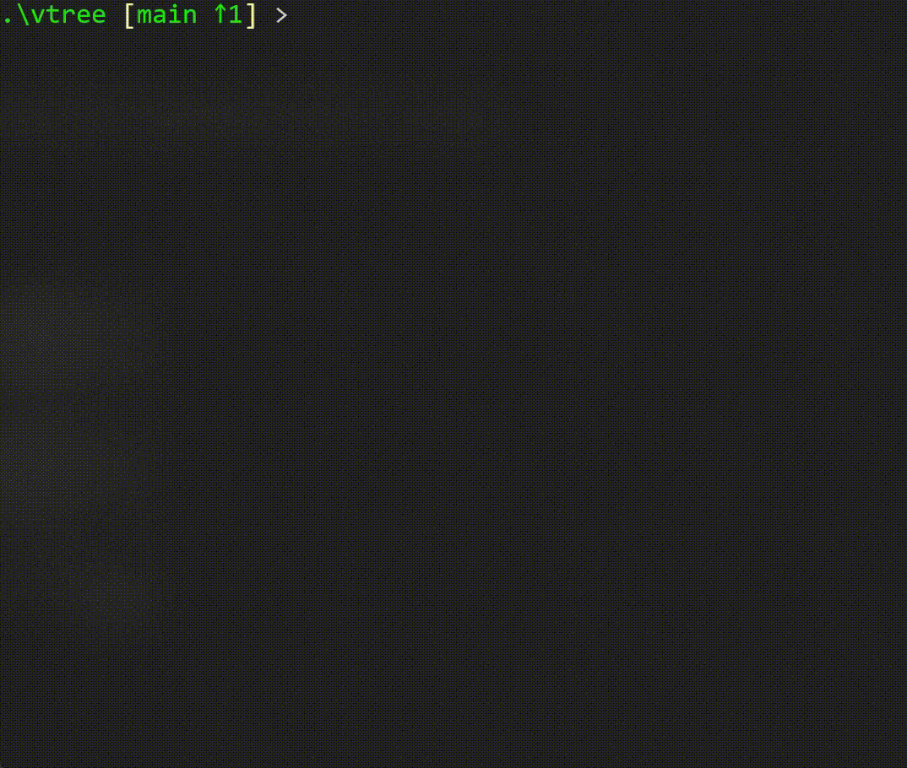

# vtree

`vtree` is a crate for building virtual file tree model under any directories.
`vtree` can be considered as an extended version of file "tags". You can put file 
references under virtual file tree to organize them, add description to files or 
directories, or run commands using the virtual path strings.



### Installation

```
$ cargo install --git https://github.com/hanjinliu/vtree
```

##### Example 1. Create project-based file tree

Under the directory where many experimental data are stored,

```
Data
  :
  ├─ 221006
  │    ├─ experiment_221006-A.csv
  │    ├─ experiment_221006-B.csv
  │    └─ experiment_221006-C.csv
  ├─ 221007
  │    ├─ experiment_221007-A.csv
  │    ├─ experiment_221007-B.csv
  │    └─ experiment_221007-C.csv
  └─ 221008
       ├─ experiment_221008-A.csv
       ├─ experiment_221008-B.csv
       └─ experiment_221008-C.csv
```

create a virtual file tree for certain project.

```
Project_A
  ├─ <shortcut to ./221006/experiment_221006-A.csv>
  ├─ <shortcut to ./221007/experiment_221007-A.csv>
  └─ <shortcut to ./221008/experiment_221008-A.csv>
```

##### Exapmle 2. Collect frequently used script files

Create a virtual file tree

```
python-scripts
  ├─ <shortcut to ./path/to/run-script-1.py>
  ├─ <shortcut to ./path/to/run-script-2.py>
  └─ <shortcut to ./path/to/run-script-3.py>
```

and run script under the virtual directory.

```
$ vtree enter python-scripts
/[python-scripts]/ > ls
run-script-1.py run-script-2.py run-script-3.py
/[python-scripts]/ > call python run-script-1.py
```
